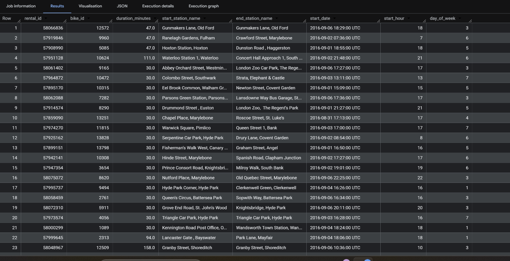

# LONDON BICYCLE DATA ANALYSIS – INSIGHTS

---

## BASIC DATA CLEANING

### 1. Question - "How was the dataset cleaned and prepared for analysis?"

**INSIGHTS:**

* Removed invalid records (zero/negative duration and extreme values > 24 hrs)
* Eliminated missing station entries for accurate analysis
* Created derived features:

  * `duration_minutes` for readability
  * `start_hour` for time-based analysis
  * `day_of_week` for weekly patterns
* Ensured consistency for downstream analysis

---

# DEMAND OVERVIEW

### 2. Question - "Which start stations have the highest number of bike rides?"

**INSIGHTS:**

* Hyde Park Corner emerges as the highest-demand station
* Indicates strong usage in central/high-footfall areas
* Suggests need for efficient bike redistribution

---

### 3. Question - "At what hour of the day are bike rides most frequent?"

**INSIGHTS:**

* Peak demand occurs during evening hours (5–6 PM)
* Morning peak (~8 AM) is also significant
* Reflects commuting and post-work travel behavior

---

### 4. Question - "Which days of the week have the highest bike usage?"

**INSIGHTS:**

* Weekdays dominate usage
* Mid-week (Tuesday–Thursday) shows highest consistency
* Sunday records the lowest demand

---

# TIME-BASED DEMAND

### 5. Question - "How does bike usage differ between weekdays and weekends?"

**INSIGHTS:**

* Weekday rides significantly exceed weekend rides
* Strong indicator of commuter-driven usage
* Weekend demand still reflects leisure activity

---

# RIDE CHARACTERISTICS (USAGE PATTERNS)

### 6. Question - "How are bike rides distributed across duration ranges?"

**INSIGHTS:**

* Majority of rides fall within 5–15 minutes
* Strong indication of last-mile connectivity usage
* Long-duration rides are comparatively fewer

---

### 7. Question - "What are the most popular routes (start to end)?"

**INSIGHTS:**

* Several routes start and end at the same station
* Indicates recreational or leisure cycling behavior
* High activity observed in central areas (e.g., parks)

---

### 8. Question - "What percentage of rides are short trips (under 10 minutes)?"

**INSIGHTS:**

* Approximately 30% of rides are short trips
* Confirms strong reliance on quick transit usage
* Highlights importance of efficient bike turnover

---

### 9. Question - "How does average ride duration vary across hours of the day?"

**INSIGHTS:**

* Shorter rides during morning commute hours
* Longer rides observed during midday and late evening
* Indicates shift from commuting to leisure usage

---

### 10. Question - "What proportion of rides are round trips?"

**INSIGHTS:**

* Only ~4% of rides are round trips
* Majority of rides are point-to-point
* Reinforces system’s role as a transport solution

---

# STATION PERFORMANCE (OPERATIONAL INSIGHTS)

### 11. Question - "Which stations experience the highest ride inflow (arrivals)?"

**INSIGHTS:**

* Central stations dominate inflow
* Hyde Park and nearby locations are high-demand zones
* Requires active redistribution strategy

---

### 12. Question - "Which stations have the highest average ride duration?"

**INSIGHTS:**

* Certain stations show significantly longer ride durations (~40+ mins)
* Likely associated with leisure or tourist areas
* Indicates non-commuter usage patterns

---

### 13. Question - "Which stations show the highest variability in ride duration?"

**INSIGHTS:**

* High variability indicates mixed usage patterns
* Same station supports both short and long rides
* Suggests multi-purpose usage zones

---

# ADVANCED INSIGHTS

### 14. Question - "Which stations experience peak demand spikes?"

**INSIGHTS:**

* Significant spikes observed at major stations
* Large gap between average and peak usage
* Highlights potential congestion risk

---

### 15. Question - "What is the weekday vs weekend usage split for top stations?"

**INSIGHTS:**

* Majority of top stations are weekday-dominant
* Some stations show relatively higher weekend usage
* Indicates varied station roles (commute vs leisure)

---

### 16. Question - "Which routes have unusually long average durations?"

**INSIGHTS:**

* Extremely high durations (~1400 minutes) indicate outliers
* Likely due to anomalies or delayed returns
* Highlights importance of data cleaning and validation

---

# FINAL INSIGHTS

**KEY TAKEAWAYS:**

* Bike usage is primarily commuter-driven
* Peak demand aligns with working hours
* Short trips dominate system usage
* Central stations act as high-demand hubs
* Data anomalies exist and must be handled carefully

**RECOMMENDATIONS:**

* Optimize bike distribution in high-demand zones
* Improve infrastructure in peak-hour stations
* Focus on short-trip efficiency
* Monitor and clean anomalous data regularly
